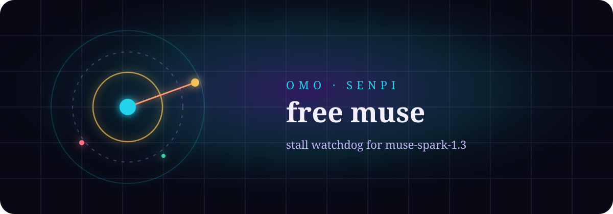

<p align="center">
  
</p>

<p align="center">
  
</p>

<h1 align="center">👁 omo-fucking-watch-extension</h1>

<p align="center">
  <b>muse-spark 가 죽으면 끊고, todo 남기고 도망치면 다시 민다.</b>
</p>

<p align="center">
  <i>HTTP 에러가 없어도. 토큰이 끊겨도. ❯ 로 돌아와도.</i>
</p>

<p align="center">
  <a href="https://github.com/code-yeongyu/oh-my-openagent"></a>
  <a href="https://dev.meta.ai/docs/coding-agents/"></a>
  <a href="https://github.com/MovieHolic-Plex/omo-fucking-watch-extension/actions/workflows/check.yml"></a>
  <a href="LICENSE"></a>
</p>

<p align="center">
  <a href="https://github.com/MovieHolic-Plex/omo-fucking-watch-extension/stargazers"></a>
  <a href="https://github.com/MovieHolic-Plex/omo-fucking-watch-extension/commits/main"></a>
  
</p>

<p align="center">
  <a href="#-설치">설치</a> ·
  <a href="#-무엇을-하나">무엇을 하나</a> ·
  <a href="#-무엇을-안-하나">안 하는 것</a> ·
  <a href="#-한-바퀴">한 바퀴</a> ·
  <a href="#-엔진이랑-같이">fallback</a> ·
  <a href="#-설정">설정</a>
</p>

```
              ·  ·  ·  WATCH  ·  ·  ·
                     ╱╲
                    ╱  ╲
                   │ ◉  │     muse-spark
                    ╲  ╱      silent hang
                     ╲╱       leftover todos
              ────────●────────
                 abort · continue
```

<p align="center">
  <code>40s</code> 무음 → abort · 열린 todo 남기고 턴 종료 → continue
</p>

<p align="center">
  
</p>

## 왜 워치가 필요한가

`cliproxy/muse-spark-1.3-contributor-free` 는 싸다. 그리고 자주 멈춘다.

HTTP 4xx/5xx 는 OmO 엔진 retry 가 잡는다.  
문제는 **에러가 안 나오는 죽음**이다. 스트림이 끊기고, 툴도 없고, 루프만 살아 있다. 아니면 todo 열어 놓고 `❯` 로 돌아온다.

그 구멍을 이 익스텐션이 본다. 예전 이름은 `omo-free-muse-extension` 이었다. 지금은 **omo-fucking-watch-extension**.

## 설치

OmO Senpi (`omo` CLI) 가 필요하다.

```bash
omo install https://github.com/MovieHolic-Plex/omo-fucking-watch-extension --no-approve
```

또는 파일을 직접 둔다.

```bash
# Windows
copy muse-watch.js %USERPROFILE%\.omo\agent\extensions\

# macOS / Linux
cp muse-watch.js ~/.omo/agent/extensions/
```

파일을 바꾼 뒤에는 그 칸에서 `/reload` 한 번이면 된다. **이미 `❯` 로 죽은 칸은 프로세스 안 훅이 못 본다.** 그건 Herdr 바깥 키커가 민다.

수동 파일 설치와 `omo install`은 둘 중 하나만 사용한다. 두 방식으로 같은 확장을
동시에 로드하면 감시와 continue가 중복될 수 있다. `/muse-watch`로 현재 모델과
미완료 작업 상태를 확인한다. `muse=false`는 비활성 오류가 아니라 Muse 외 모델을
건드리지 않는 정상 상태다.

```bash
# Linux
python3 idle-todo-kick.py --daemon
python3 idle-todo-kick.py --once

# Windows — pythonw 로 콘솔 없이. herdr 호출도 CREATE_NO_WINDOW.
python idle-todo-kick.py --daemon
python idle-todo-kick.py --once
```

idle + muse + 열린 todo 면 continue 를 넣는다. `omo -r` 은 필요 없다.

### Linux에서 외부 감시기 상시 실행

`--daemon`은 한 번 실행할 뿐, 종료 후 자동 복구나 로그인 시 시작을 등록하지 않는다.
상시 실행에는 사용자 systemd 서비스를 사용한다. Herdr가 실행 중이어야 하며,
아래 서비스와 `--daemon`을 동시에 실행하지 않는다.

```bash
git clone https://github.com/MovieHolic-Plex/omo-fucking-watch-extension ~/omo-fucking-watch-extension
cd ~/omo-fucking-watch-extension
python3 idle-todo-kick.py --dry-run
mkdir -p ~/.config/systemd/user
cp systemd/omo-idle-todo-kick.service ~/.config/systemd/user/
systemctl --user daemon-reload
systemctl --user enable --now omo-idle-todo-kick.service
systemctl --user status omo-idle-todo-kick.service
```

다른 경로에 복제했다면 서비스의 `ExecStart` 경로를 바꾼다.
`--dry-run`은 실제 Herdr 화면을 읽지만 continue를 보내지 않는다.
로그는 `journalctl --user -u omo-idle-todo-kick.service`에서 확인하고,
중지와 자동 시작 해제는 `systemctl --user disable --now omo-idle-todo-kick.service`로 한다.
이미 열린 OmO 세션의 확장 코드를 갱신하려면 각 세션에서 `/reload`가 필요하다.

예전 레포 URL `MovieHolic-Plex/omo-free-muse-extension` 은 GitHub가 여기로 리다이렉트한다.

## 무엇을 하나

메인 세션에서 **지금 모델이 muse-spark** 일 때 두 가지를 잡는다.

**1. Silent hang** — 루프가 아직 도는데 스트림·툴이 40초 동안 없으면 abort 하고 이어서 돌린다.

**2. 조기 정지** — 턴이 끝났거나 이미 `❯` idle 인데 아래 **세션 state** 가 남아 있으면 follow-up 으로 같은 일을 계속한다.

- `senpi.todo-state` 의 `pending` / `in_progress`
- `muse-watch.contract` — 모델이 연 턴마다 쓰는 `I'll stop when …` 를 custom entry 로 고정. PR URL 이 조건인데 transcript 에 pull 링크가 없으면 unmet.

wish-ai-3 처럼 todo 를 안 남기고 끊긴 칸은, 말 꼬리를 추측하지 않는다. 선언한 stop-when 을 state 로 저장한 뒤 그게 안 채워졌는지만 본다.

둘 다 토스트가 뜬다. hang 은 세션당 4번, 조기 정지는 6번까지.

프로세스 내부 워치는 실행 중인 도구와 엔진 retry를 무음 정지로 오인하지 않는다.
사용자 abort 뒤에는 새 실행이 시작될 때까지 자동 재개를 멈추며,
모델을 확인할 수 없을 때도 임의로 Muse라고 가정하지 않는다.
`no PR/merge`처럼 명시적으로 제외한 PR은 미충족 조건으로 잡지 않는다.

외부 키커의 종료 조건 조회는 Herdr가 알려 준 정확한 세션 ID/경로를 우선한다.
그 정보가 없으면 같은 CWD에 세션이 하나뿐인 경우에만 조회하며, 여러 세션 중
최신 파일을 추측해서 다른 칸을 재개하지 않는다. Herdr 호출은 10초로 제한한다.

Senpi 는 `ctx.model` 이다. omp 의 `ctx.models.current()` / `ctx.setTimeout` 만 보고 짜면 `/reload` 해도 안 돈다. 이 워치는 둘 다 받는다.

## 무엇을 안 하나

이 익스텐션은 **부모 세션의 메인 루프**만 본다. `ctx.isIdle()` 은 서브에이전트 개수가 아니다.

| 상황 | 담당 |
| --- | --- |
| 메인 칸 Muse 가 말없이 멈춤 | **이 익스텐션** (hang) |
| 메인 칸 Muse 가 todo 남기고 프롬프트로 복귀 | **이 익스텐션** + **idle-todo-kick.py** |
| todo 없이 `I'll stop when` 이 안 채워짐 | **이 익스텐션** (`muse-watch.contract`) |
| HTTP 에러 / 첫 토큰 타임아웃 | `settings.json` `retry.fallbackChains` |
| `task` 로 띄운 백그라운드 Muse 워커 | `is_unstable_agent` + babysitter + category `models[]` |
| 이미 `❯` idle 인데 todo 가 남음 | **idle-todo-kick.py** (Herdr 바깥) |
| omo 프로세스 자체 사망 | 훅도 같이 죽음. Herdr 바깥 감시 |

`is_unstable_agent: true` 카테고리 워커는 부모가 idle 이라 워치독이 스킵한다. 그 구멍은 fallback 체인 몫이다.

## 한 바퀴

```
hang (every 5s)
  ├─ muse + not idle + 40s silent → abort → continue

조기 정지
  ├─ agent_end: muse + 열린 todo
  ├─ session_start /reload: muse + 열린 todo
  └─ idle poll: muse + ❯ + 열린 todo (8s 유예)
```

Senpi 는 `ctx.model` 이고 `ctx.setTimeout` 이 없다. omp 는 `ctx.models.current()` 와 contained timer 가 있다. Senpi 에서는 raw timer 를 try/catch 하고 `/reload` 의 `session_shutdown` 에서 지운다. 안 그러면 stale ctx 가 세션을 죽인다. idle 에서는 `deliverAs: followUp` 없이 바로 send 한다.

## 엔진이랑 같이

권장 짝:

`~/.omo/agent/settings.json`

```json
{
  "retry": {
    "enabled": true,
    "modelFallback": true,
    "maxRetries": 3,
    "fallbackChains": {
      "cliproxy/muse-spark-1.3-contributor-free": ["xai/grok-4.6:xhigh"]
    },
    "provider": {
      "streamStartTimeoutMs": 25000,
      "timeoutMs": 45000,
      "streamRetryTimeoutMs": 15000
    }
  }
}
```

`~/.omo/omo.jsonc` 의 Senpi 블록 (OpenCode 전용 `[opencode]` 만 있으면 standalone `omo` 는 안 읽는다):

```jsonc
"[senpi]": {
  "runtime_fallback": {
    "enabled": true,
    "retry_on_errors": [400, 401, 403, 404, 408, 429, 500, 502, 503, 504],
    "max_fallback_attempts": 5,
    "cooldown_seconds": 20,
    "timeout_seconds": 15,
    "notify_on_fallback": true,
    "restore_primary_after_cooldown": true
  }
}
```

```
Muse 턴
  ├─ 에러 / 25s 첫토큰 / 45s 전체     → retry → grok-4.6
  └─ 에러 없이 40s 무음                 → fucking-watch abort → continue
```

## 설정

| 환경변수 | 기본 | 의미 |
| --- | --- | --- |
| `OMO_MUSE_WATCH` | on | `0` / `false` / `off` 이면 비활성 |
| `OMO_MUSE_STALL_MS` | `40000` | 무음 판정. 최소 1000 |
| `OMO_MUSE_IDLE_TODO_MS` | `8000` | idle 에서 todo continue 하기 전 유예 |
| `OMO_IDLE_TODO_KICK` | on | Herdr 바깥 키커. `0` 이면 끔 |
| `OMO_IDLE_TODO_KICK_EVERY_MS` | `15000` | 바깥 키커 폴링 |
| `OMO_IDLE_TODO_KICK_COOLDOWN_MS` | `90000` | 같은 칸 재kick 간격 |
| `OMO_IDLE_TODO_KICK_MAX` | `6` | 같은 todo 서명당 최대 kick |

의존성 없음. 파일 하나. `muse-watch.js`.

## 검증

Node.js와 Python 3가 설치된 환경에서 `npm run check`를 실행한다.
JavaScript 구문 검사, 가상 타이머 기반 확장 이벤트 회귀 테스트,
외부 감시기 Python 단위 테스트를 함께 실행하며 모델 API 호출은 하지 않는다.

## 라이선스

MIT. Muse 는 공짜로 돌리고, 멈춤은 공짜로 자른다.
